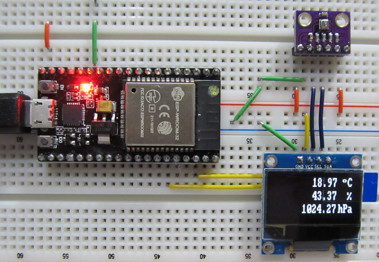

# mruby-esp32-i2c-bme280

BME280 (I2C) library for mruby-esp32.

This library is a for the BOSCH BME280 digital humidity, pressure and temperature sensor running on the mruby-esp32.

# Installation

Add the line below to your `esp32_build_config.rb`:

```ruby
  conf.gem :github => 'icm7216/mruby-esp32-i2c-bme280'
```

# Usage

Example of measurement humidity, pressure and temperature by bme280 sensor.

I2C Wiring
```
   BME280       NodeMCU-32S(ESP32)
      VCC ----> 3v3  (3.3V)
      GND ----> GND
      SCL ----> GPIO 22
      SDA ----> GPIO 21
      CSB xxxx
      SD0 ----> VCC  (I2C Bus address = 0x77)
```

BME280 I2C Bus address is `0x76`, if you connect from `SDO` to `GND`.
```ruby
i2c = I2C.new(I2C::PORT0, scl: 22, sda: 21).init(I2C::MASTER)
bme280 = SENSOR::BME280.new(i2c, 0x76).init
```

BME280 I2C Bus address is `0x77`, if you connect from `SDO` to `VCC`. (If the address is omitted, it is set to `0x77`.)
```ruby
i2c = I2C.new(I2C::PORT0, scl: 22, sda: 21).init(I2C::MASTER)
bme280 = SENSOR::BME280.new(i2c).init
```

In advance, you will need to add several mrbgems to `esp32_build_config.rb`
```ruby
  conf.gem :core => "mruby-sprintf"
  conf.gem :core => "mruby-toplevel-ext"
  conf.gem :github => "mruby-esp32/mruby-esp32-i2c"
  conf.gem :github => "mruby-esp32/mruby-esp32-system"
  conf.gem :github => "icm7216/mruby-esp32-i2c-ssd1306"
```

# code

## Example 1: single-Shot measurement (for connect test)

Output to the serial console.
```ruby
include ESP32

i2c = I2C.new(I2C::PORT0, scl: 22, sda: 21).init(I2C::MASTER)
bme280 = SENSOR::BME280.new(i2c)
bme280.init

puts "temp: #{'%.2f' % bme280.temperature}"
puts "hum:  #{'%.2f' % bme280.humidity}"
puts "press:#{'%.2f' % bme280.pressure}"
```

## Example 2: repeated measurement with loop

Output to the SSD1306 OLED display.



```ruby
include ESP32

i2c = I2C.new(I2C::PORT0, scl: 22, sda: 21).init(I2C::MASTER)
bme280 = SENSOR::BME280.new(i2c).init
oled = OLED::SSD1306.new(i2c).init.clear

def view_data(oled, bme280)
  temperature = "#{'%.2f' % bme280.temperature}"
  humidity =    "#{'%.2f' % bme280.humidity}"
  pressure =    "#{'%.2f' % bme280.pressure}"

  oled.clear
  oled.fontsize = 1
  oled.text(102,  0, " o")
  oled.fontsize = 2
  oled.text(118,  0, "C")
  oled.text(118, 21, "%")
  oled.text(104, 42, "hPa")
  oled.text(62,  0, temperature)
  oled.text(62, 21, humidity)
  oled.text(46, 42, pressure)
  oled.display
end

loop do
  view_data(oled, bme280)
  GC.start  
  System.delay(1000) 
end
```

# using library

**Many thanks!**

*   I2C library for mruby-esp32 by [mruby-esp32/mruby-esp32-i2c](https://github.com/mruby-esp32/mruby-esp32-i2c)
*   This libraries are adapted from bme280.rb by [lukasjapan/i2c-bme280](https://github.com/lukasjapan/i2c-bme280)
*   BME280 Datasheet - [Bosch Sensortec](https://ae-bst.resource.bosch.com/media/_tech/media/datasheets/BST-BME280_DS001-12.pdf)

# License

MIT
